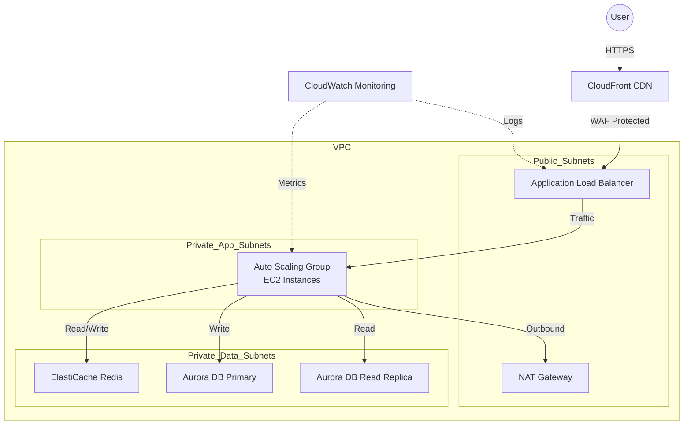

# Task 5: AWS Architecture Diagram

## 1. Architecture Explanation
To handle 10,000 concurrent users, I designed a highly scalable and resilient 3-tier architecture:
- **Frontend/Edge**: Uses **CloudFront** (CDN) to cache static content globally and **WAF** to protect against attacks (DDoS, SQLi).
- **Load Balancing**: An **Application Load Balancer (ALB)** distributes incoming traffic across multiple Availability Zones (AZs).
- **Compute Layer**: An **Auto Scaling Group (ASG)** of EC2 instances in private subnets handles the application logic. It scales out/in based on CPU/Memory usage.
- **Database Layer**: **Amazon Aurora (MySQL/PostgreSQL)** is used for the database due to its high performance and auto-scaling storage. A Read Replica is added for offloading read traffic.
- **Caching**: **ElastiCache (Redis)** is implemented to cache frequent database queries and session data, reducing DB load and latency.
- **Security**: All resources are in a VPC. Public subnets host only the ALB/NAT. Private subnets host App and DB layers. Security Groups and NACLs act as firewalls.

## 2. Architecture Diagram
> **Instructions**: Use the Mermaid code below to visualize the architecture, or recreate it in draw.io using the components described above.

### Upload your Draw.io Diagram
> **[Upload your PNG/PDF here]**

## 3. GitHub Link
(Optional: If you commit the diagram file to this repo, link it here)
